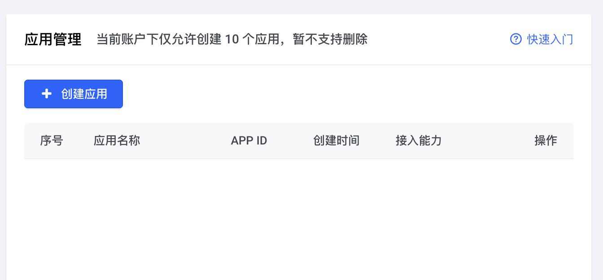
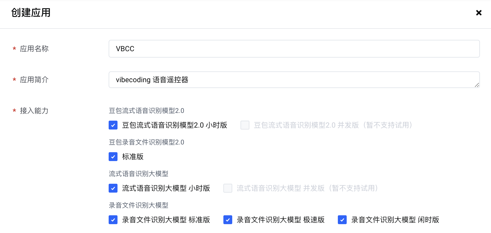
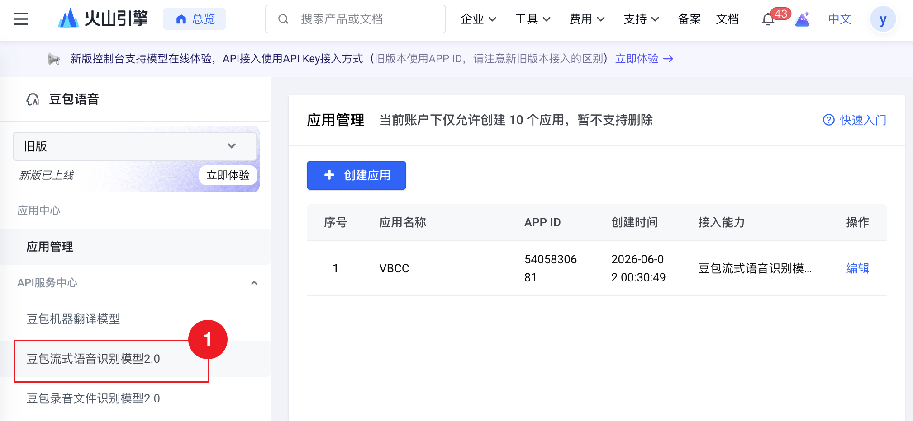
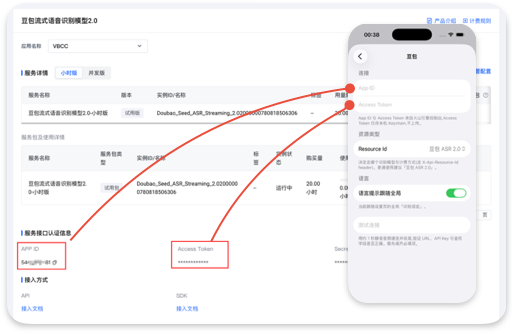

+++
date = '2026-06-01T21:03:25+08:00'
draft = false
title = '如何在VBCC中添加豆包ASR识别引擎'
+++

首先登录火山引擎，进入[豆包语音控制台](https://console.volcengine.com/speech/)，根据提示需要先完成实名认证。

<!--more-->

按照上图填写，并勾选相应的模型能力即可。确认后豆包将会赠送20h免费时长。

选择侧边栏「豆包流式语音识别模型2.0」，将右侧的 APP ID 和 Access Token 分别填写到 vbcc 的配置页面上，最后点击测试。
